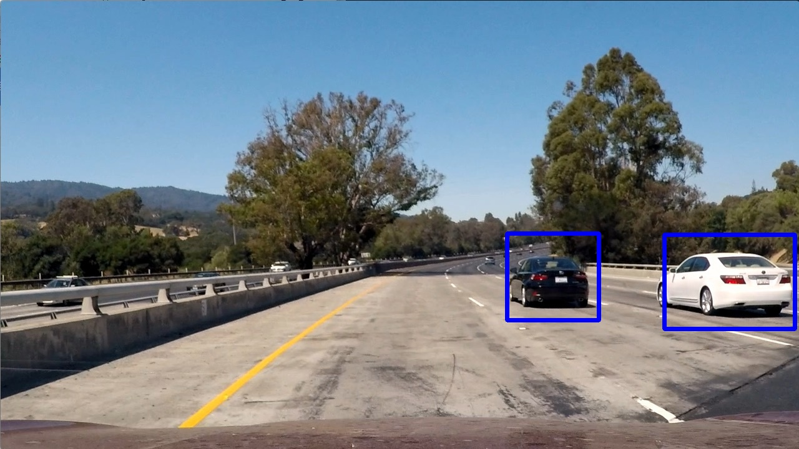
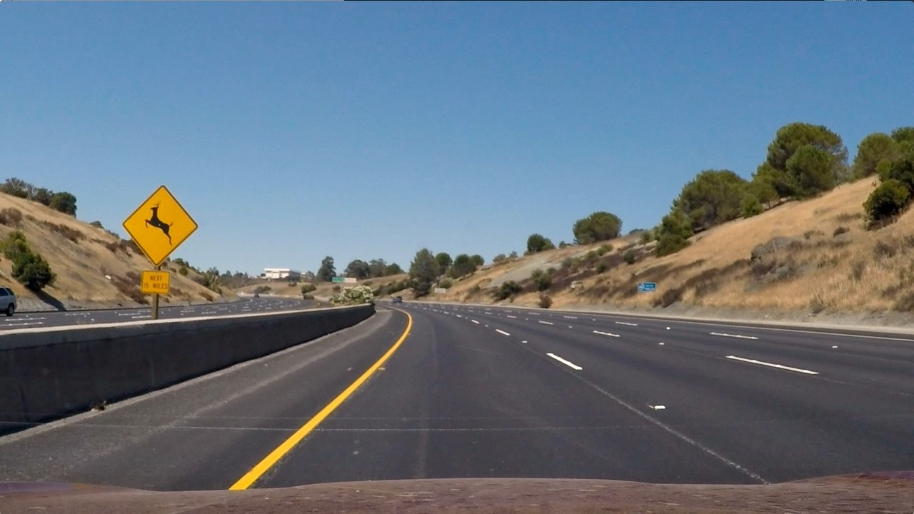
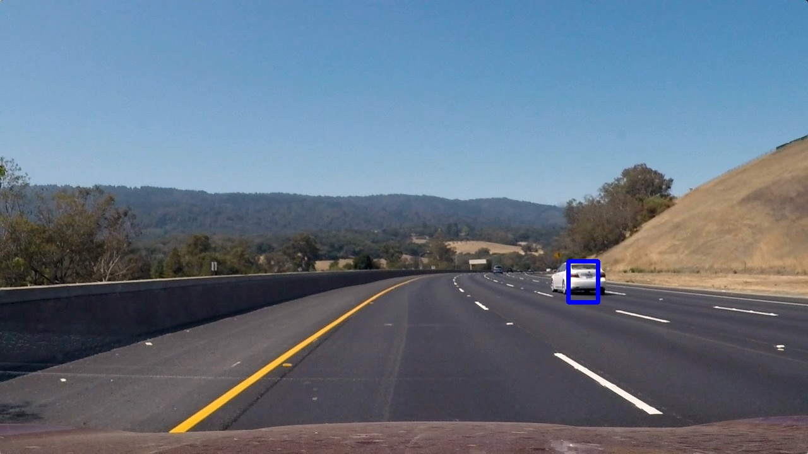
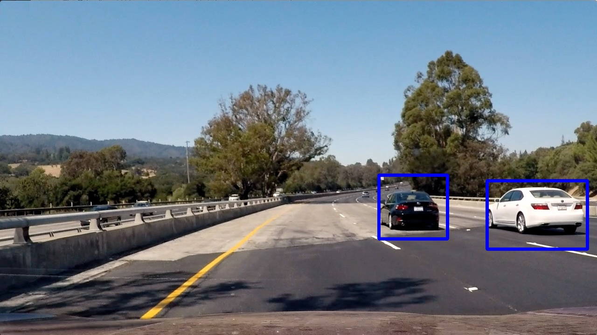
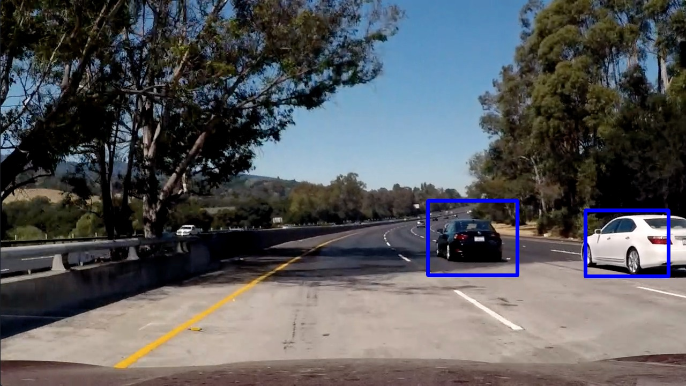
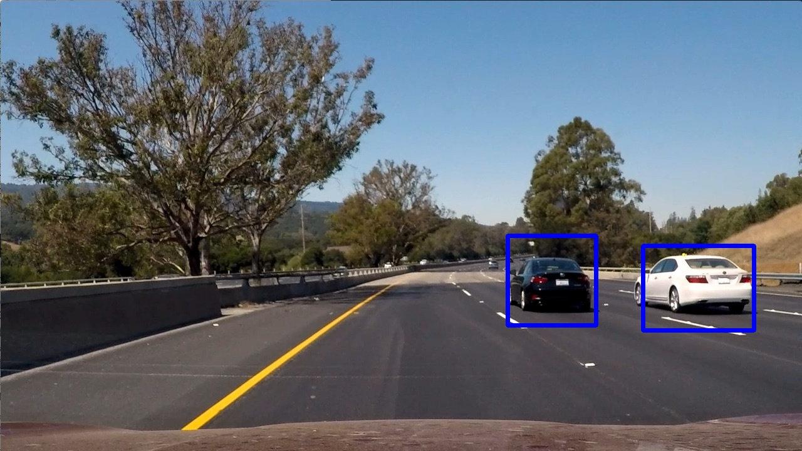

Self Driving Car Nanodegree Project 5: Vehicle Detection
========================================================

In this project, I wrote an image processing pipeline to detect vehicles in
still images and video. The general process is as follows:

1. Train a binary image classifier using Histogram of Oriented Gradients (HOG)
  features from from vehicle and non-vehicle example images.
2. Use a sliding window technique to search for vehicles in images at multiple
  scales.
3. Create a heat map of the detected vehicle bounding boxes and estimate a
  single bounding box for each vehicle based on the heatmap.
4. Extend the pipeline to a video stream, persisting the heatmaps from frame
  to frame with decay for smoother, more consistent detections.

Feature Extraction
------------------

Based on the examples in the lessons, I chose to use a combination of HOG and
color features. I felt that spatial features were redundant with HOG and also
likely to introduce overfitting to the specific images in the training set.

To extract HOG features, I used a `get_hog_features()` in `util.py`, which is
closely based on the example given in the lesson. It wraps SciKit Image's
`skimage.feature.hog` function to reduce the number of parameters required. Like
the lessons, I chose to use the `YCrCb` colorspace for this project. Because of
the way `YCrCb` splits color channels, it separates luminance from color, which
makes it good for feature detection. I chose to only calculate HOG features on
the `Y` (luminance) channel. I found that this had little to no affect on the
accuracy of my classifier vs using all three channels and it significantly cut
down on the time needed to calculate HOG features.

For the other HOG parameters (orientations, pixels_per_cell, cells_per_block), I
initially tested the values used in the lesson, and I found that they worked
well (~98% accuracy), so I decided not to change them.

For color feature data, I used a 32-bin histogram on each of the three channels.
Because there are so many fewer color features than HOG features (96 vs 1764), I
don't think the color features have a large impact on detections.

Here are the parameters that I ultimately used for feature extraction:

| Parameter           | Value |
|---------------------|-------|
| Color Space         | YCrCb |
| Histogram Bins      | 32    |
| Hog Orientations    | 9     |
| Hog Pixels Per Cell | 8     |
| Hog Cells Per Block | 2     |
| Hog Channel         | 0 (Y) |

My feature extraction methods can be found in `util.py`, but my processing
pipeline uses whole-image methods for speed, as discussed below.

Classifier
----------

For this project, I chose to use a linear Support Vector Machine (SVM). Various
background research has shown that SVM is a good compliment to HOG features, and
my results concur.

I trained my classifier from the Udacity training sets of
[vehicles](https://s3.amazonaws.com/udacity-sdc/Vehicle_Tracking/vehicles.zip)
and [non-vehicles](https://s3.amazonaws.com/udacity-sdc/Vehicle_Tracking/non-vehicles.zip)
using the included Python program  `train_classifier.py`, I was able
to consistently achieve accuracy of about 98% on a test set consisting of a
randomly selected 20% of the labeled data input. Before training the classifier,
the data was scaled using a `sklearn.preprocessing.StandardScaler` fit to the
training set, which scaled the data to zero mean and unit variance. To avoid
having to retrain my classifier every time I run the program, I saved the
classifier, parameters, and scaler to a Python pickle `classifier.p` to quickly
load into the detection pipeline.

Image Processing -- Sliding Window Search
-----------------------------------------

The processing pipeline is invoked from `detect_vehicles.py`, but the processing
code is in `detector.py`, which defines a `Detector` class. `Detector` is a
callable that takes in an image and returns bounding boxes of probably vehicles
using a three step pipeline:

1. At multiple scales and ROIs, perform a sliding window search using the
  feature extractor and classifier.
2. Draw the classifier "hits" (likely vehicle bounding boxes) onto a heatmap.
3. Threshold the heatmap to reduce false-positives.
4. Return bounding boxes of the thresholded heat map.

`detect_vehicles.py` then draws the bounding boxes from the `Detector` on the
image and displays or saves it as requested.

To find cars in images, I used a sliding window search at multiple scales.
Initially, I generated a set of windows and applied feature extraction to each
one independently, but I found that this method was far too slow, taking tens
of seconds per image. Instead, I pre-computed the HOG image at each scale and
slid the window over the HOG image for faster processing. Similarly, I used
`skimage.filters.rank.windowed_histogram` to rapidly compute a sliding window
histogram of the whole image at multiple scales. With these methods and well-
chosen ROIs, I was able to process frames at about one per second. I balanced
my overlap and scales to remain accurate while keeping processing time
manageable.

Ultimately, I decided on the following set of scales, overlaps, and ROIs:

**Scales table**

**Some discussion is given around how you improved the reliability of the classifier i.e., fewer false positives and more reliable car detections (this could be things like choice of feature vector, thresholding the decision function, hard negative mining etc.)**

Video Processing
----------------

The output of the pipeline on the test video can be found [here](test_video_out.mp4),
and the output of the pipeline on the project video can be found
[here](project_video_out.mp4).

The main difference between the video pipeline and the single-image pipeline is
the persistence of heatmaps. Instead of basing detections on a single frame's
heatmap, the heatmaps are filtered together using an exponential filter with a
smoothing factor of **SMOOTHING FACTOR**. This causes heat from previous frames
to persist with exponential decay. This filters out jitter, but it also
increases the accuracy of detections. Because cars cannot instantaneously jump
from frame to frame, the heat from the previous frames provides more information
that may not exist in the current frame due to lighting or other factors.

Discussion
----------

**Discussion includes some consideration of problems/issues faced, what could be improved about their algorithm/pipeline, and what hypothetical cases would cause their pipeline to fail.**

Results
-------

Here are the results of running this processing pipeline on the test images:

